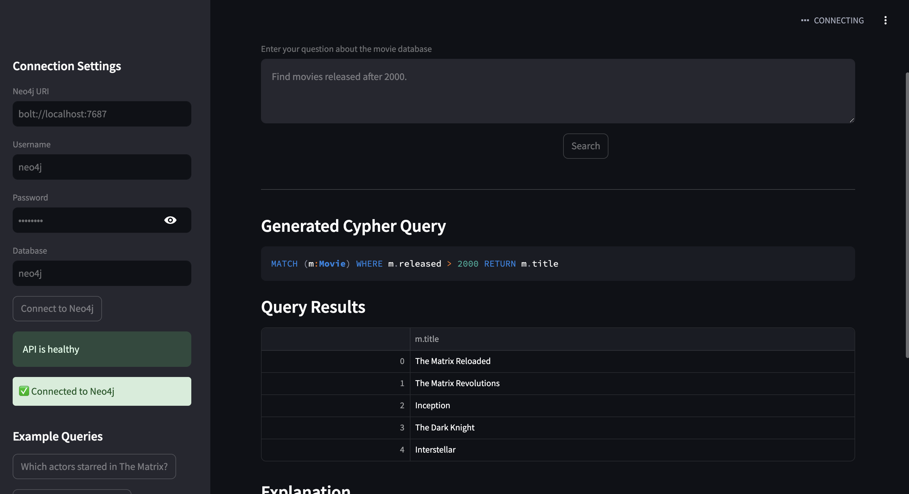

# Chatbot-Lite

Chatbot-Lite is a lightweight chatbot application built using FastAPI for the backend and Streamlit for the frontend. It leverages LLaMA for NLP processing and uses Neo4j as a knowledge graph database.
**note (This is to showcase that queries are generated successfully by the llm model , the main project is in - https://github.com/harshagr70/LLM_chatbot
this project does not use HTML ,CSS for frontend , this is just an extra to the main project.
---

## Setup Instructions

### Prerequisites

Ensure you have the following installed:

- Python (>=3.8)
- pip and venv (Python package manager and virtual environments)
- [OLLama](https://ollama.com/download/mac) model setup
- Neo4j with an example dataset loaded

---

### 1. Clone the Repository

```sh
git clone https://github.com/yourusername/chatbot-lite.git
cd chatbot-lite
```
---
## 2. Set New Enviroment 
```sh
python -m venv venv
source venv/bin/activate  # On Windows use: venv\Scripts\activate
```
---
## 3. Install dependencies
```sh
pip install -r requirements.txt
```
---
## 4. Start server 
```sh
python server.py
```
---
## 5. Run UI 
(open a new terminal and activate the enviroment and then run the following command)
```sh
python new.py
```
## Demo 


## How To Use ?
Once the setup is done the command ```sh python new.py ``` will open the ui in the browser 
Fill the connection details for the database and connect to the database 
Chatbot is now ready to be used , you can use the example questions or custom questions 
